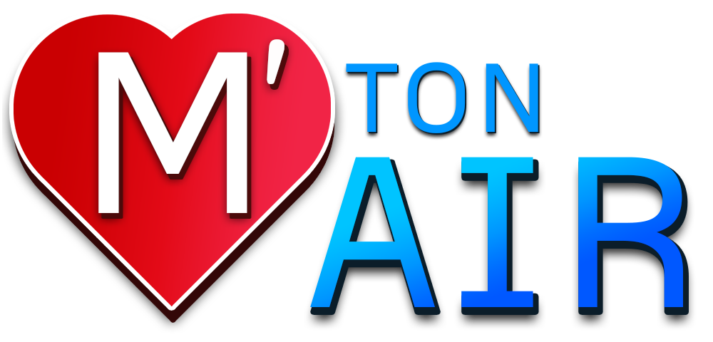
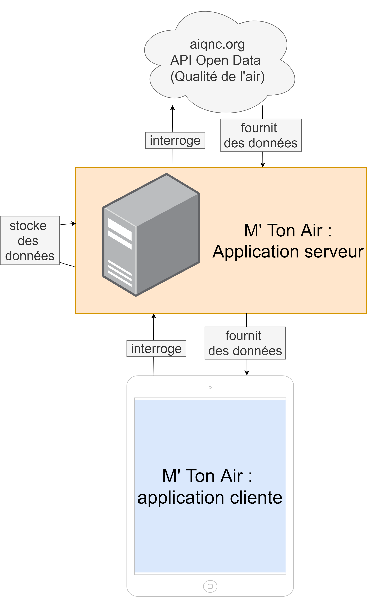

# Client Project

This is the M' Ton Air client project, part of the "M' Ton Air" project, which means "Love Your Air" in french. Its purpose is to allow users to have daily reports concerning Air Quality in their geographic zone and all around the world.

It will be / is released as an Android App, developed with React Native.

## Project structure

## Wireframe and design

