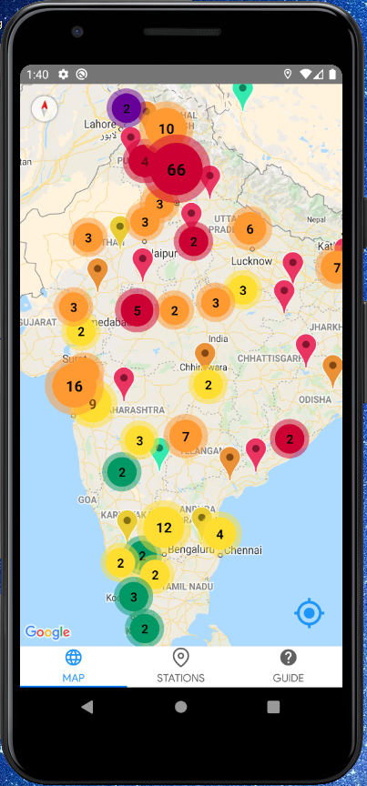
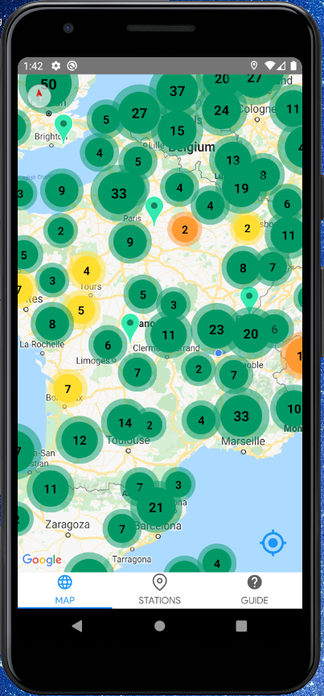

# Client Project

This is the M' Ton Air client project, part of the "M' Ton Air" project, which means "Love Your Air" in french. Its purpose is to allow users to have daily reports concerning Air Quality in their geographic zone and all around the world.

It will be / is released as an Android App, developed with React Native.

## Project structure

## Wireframe and design

## Development

Head over to the official [React Native Documentation](https://reactnative.dev/docs/environment-setup) in
order to :

- set up Android Studio,
- set up an sdk,
- set up a virtual device.

Then, start your android emulator, go into the "MTonAir" folder and run :

> npx react-native start

(there's a [start.cmd](MTonAir/start.cmd) file for Windows users...).

And finally, run :

(in the MTonAir folder)

> npm install

> npx react-native run-android

in another command window.

Then, the app should start in your virtual device. Press the R key twice or select `Reload` from the Developer Menu (`CTRL + M`) to see the changes.
Read the [React Native Documentation](https://reactnative.dev/docs/environment-setup), "environment setup" section for any more help.

You'll also have to start the MTonAir server on localhost 8080 and to insert your Maps API KEY into the Android Manifest : https://github.com/M-Ton-Air/M-Ton-Air-client/blob/master/MTonAir/android/app/src/main/AndroidManifest.xml
